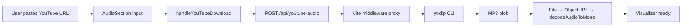
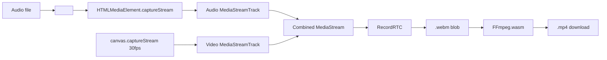

# GeneradorVideoWave — Agent Guide

## Commands

### Docker (primary — dev environment)
```bash
docker compose up -d          # start dev server on port 3000 (background)
docker compose restart        # restart container (pick up code changes)
docker compose down           # stop container
docker compose logs -f        # follow logs
```

### Local (alternative — requires node/npm locally)
```bash
npm install          # install dependencies
npm run dev          # start dev server on port 3000
npm run build        # build to dist/
npm run preview      # serve dist/ locally
```

No test, lint, or typecheck scripts exist.

## File tree

```
src/
├── main.tsx                  # Entrypoint React (StrictMode → App)
├── App.tsx                   # Layout: header + AudioVisualizerG + footer + YouTube example
├── index.css                 # Tailwind layers, glass/custom scrollbar/range/color/file inputs
├── ffmpeg.d.ts               # Type declarations for FFmpeg.wasm (FFmpegInstance, Window.FFmpeg)
├── recordrtc.d.ts            # Type declaration for RecordRTC (any)
├── vite-env.d.ts             # Vite client types
├── components/
│   ├── AudioVisualizerG.tsx  # ~1894 lines — main component (refactored, sections extracted)
│   ├── CollapsibleSection.tsx # Reusable collapsible wrapper (extracted from AudioVisualizerG)
│   ├── ConversionProgress.tsx # Cyberpunk terminal overlay during WebM→MP4 conversion
│   ├── FileDropZone.tsx      # Drag-and-drop wrapper (extracted from AudioVisualizerG)
│   ├── IAAsistentPanel.tsx   # IA Assistant panel (2-column header, playback controls, reset w/ confirm modal)
│   ├── ConfirmModal.tsx       # Reusable confirm modal (createPortal, ESC/click-outside close, red confirm)
│   ├── AudioCutterModal.tsx   # Audio trimmer modal (waveform canvas, markers, FFmpeg cut)
│   └── sidebar/
│       ├── AudioSection.tsx
│       ├── PresetsSection.tsx
│       ├── WaveSection.tsx
│       ├── BgSection.tsx
│       ├── FractalSection.tsx
│       ├── InstinctSection.tsx
│       ├── ParticlesSection.tsx
│       ├── TextSection.tsx
│       └── ExportSection.tsx
├── hooks/
│   ├── useAudioAnalyser.ts   # Micrófono hook (getUserMedia → AnalyserNode, NOT integrated)
│   └── useIAAsistent.ts      # IA Assistant hook: BPM detection, beat scheduling, parameter changes
└── utils/
    ├── audio.ts              # ~30 lines — buildPrecomputedGeometry, getCurrentAmplitude (extracted)
    ├── canvas.ts             # ~28 lines — clearCanvasSolid, syncAllCanvasSizes, setCanvasVideoSize (extracted)
    ├── convertWebmToMp4.ts   # FFmpeg.wasm init + WebM→MP4 conversion (ultrafast preset)
    ├── fondo.ts              # ~34 lines — BgMode, bgPresets, drawFondoCanvas
    ├── fractals.ts           # ~330 lines — FractalType, FractalParams, ripple/spiral/mandala draw + preview
    ├── instinct.ts           # ~277 lines — InstinctMode, InstinctParams, 4 instinct modes + drawInstinctPreview
    ├── particles.ts          # ~38 lines — Particle, emitParticles, updateAndDrawParticles
    ├── title.ts              # ~55 lines — TITLE_PRESETS, drawTitle
    └── wave.ts               # ~127 lines — Point, fftLikePointsPerCircle, drawAdditionalPath, drawTip, drawStaticWaveform

public/
├── fondo_muestra_1.png
├── fondo_muestra_2.png
├── fondo_muestra_3.png
└── fondo_muestra_4.jpg

Infra: Dockerfile, Dockerfile.dev, docker-compose.yml, vercel.json, .cert/
vite.config.ts  — Vite plugins (React, COEP/COOP headers, youtube-audio-proxy)
```

## Utilities & constants

| Symbol | Source | Value/Purpose |
|--------|--------|---------------|
| `TWO_PI` | fractals.ts | `2π` |
| `GOLDEN_ANGLE` | fractals.ts | `2.39996…` (phyllotaxis spiral) |
| `fftLikePointsPerCircle` | wave.ts | `2600` (sample step divisor) |
| `TITLE_PRESETS` | title.ts | 10 title style presets |
| `bgPresets` | fondo.ts | 5 background color presets |
| `INSTINCT_MODES` | instinct.ts | `{value, icon, label}[]` — water/organic/fragments/ifs |
| `FRACTAL_TYPES` | fractals.ts | `{value, icon, label}[]` — ripple/spiral/mandala |
| `formatBytes(n)` | AudioVisualizerG.tsx | B/KB/MB/GB formatting |
| `clamp(n, min, max)` | fractals.ts | Number clamping |
| `hexToRgba(hex, alpha)` | fractals.ts | Hex → `rgba(r,g,b,a)` |

## Types

```typescript
// fractals.ts
type FractalType = "ripple" | "spiral" | "mandala";
interface FractalParams { fractalType, fractalAudioReactive, ripple*, spiral*, mandala*, bgColor }

// instinct.ts
type InstinctMode = "water" | "organic" | "fragments" | "ifs";
interface InstinctParams { instinctMode, instinctSpeed, instinctStrength, instinctFrequency, bgColor, fractalAudioReactive }

// wave.ts
type Point = { x: number; y: number };
type WaveStyle = { radiusRatio, intensity, strokeWidth, waveColor, glowIntensity, waveGradientMode, gradColor1, gradColor2 };
type WaveData = { monoSamples, cosArr, sinArr, totalSamples, sampleStep, pointCount };

// particles.ts
type Particle = { x, y, vx, vy, life, maxLife, size };

// fondo.ts
type BgMode = "color" | "image" | "fractal";

// AudioVisualizerG.tsx
type WaveGradientMode = "solid" | "gradient" | "rainbow";
```

## Key architecture

- **Entrypoint**: `src/main.tsx` → `App.tsx` → renders `<AudioVisualizerG />`
- **Main component**: `src/components/AudioVisualizerG.tsx`
- **Styling**: Tailwind CSS v3 (Inter, glass morphism, dark theme, custom scrollbar, animations)
- Single-page app, no routing, no monorepo.

## Audio decoding pipeline

Two input modes: **file upload** or **YouTube URL download**.

### File upload path
1. `onPickFile` → `URL.createObjectURL` + `decodeAudioToMono`

### YouTube path
1. `handleYouTubeDownload` → `POST /api/youtube-audio` → yt-dlp proxy → MP3 blob
2. Creates `File` from blob → `URL.createObjectURL` → `decodeAudioToMono`

### Shared decoding
1. `AudioContext.decodeAudioData()` → raw PCM
2. Mix all channels to mono (`Float32Array`)
3. Precompute circular cos/sin arrays mapping `pcmIndex → angle = (idx/total)*2π - π/2`
4. `fftLikePointsPerCircle = 2600` — sample step = `max(1, total/2600)`

Audio is **not** streamed through Web Audio API nodes; raw samples are indexed directly by `currentTime / duration`.

## YouTube audio download

The Audio section has two modes toggled by buttons at the top: **Subir archivo** (file upload) and **YouTube** (URL download).

### Architecture



### Backend proxy (`vite.config.ts`)

A Vite dev-server plugin (`youtube-audio-proxy`) registers `POST /api/youtube-audio`:

1. Validates the URL with regex `/youtu(\.be|be\.com)/`
2. Runs `yt-dlp --print %(title)s <url>` (30s timeout) to fetch the video title
3. Runs `yt-dlp -x --audio-format mp3 --audio-quality 128K -o /tmp/ytaudio_<hex>.mp3 <url>` (300s timeout)
4. Returns the MP3 as `audio/mpeg` with `X-Video-Title` header (URL-encoded title)
5. Cleans up the temp file in `finally`

**Flags**: `--js-runtimes deno`, `--extractor-args youtube:player_client=android`, `--no-playlist`

**Dev-only**: the middleware is registered via `configureServer()`, so it only works with `npm run dev` (not production builds unless a separate backend is deployed). Requires `yt-dlp` installed on the host.

### Client handler (`handleYouTubeDownload` in `AudioVisualizerG.tsx`)

1. Validates URL (non-empty, matches YouTube regex); shows Spanish error on failure
2. Stops any active animation/preview, revokes previous audio object URL, resets waveform refs
3. Sends `POST /api/youtube-audio` with `{ url }`
4. On success: extracts title from `X-Video-Title` header, creates `File` named `<title>.mp3`, creates object URL, calls `decodeAudioToMono(file)`
5. On error: parses JSON error body, shows message

### State

| Variable | Type | Purpose |
|----------|------|---------|
| `audioSourceMode` | `"file" \| "youtube"` | Current audio input mode (default `"file"`) |
| `youTubeUrl` | `string` | YouTube URL input |
| `isDownloading` | `boolean` | Loading state for YouTube download |

### AudioSection UI (`src/components/sidebar/AudioSection.tsx`)

- Two toggle buttons: "Subir archivo" (indigo) / "YouTube" (red)
- YouTube mode: text input (`"Pega el link de YouTube aquí..."`) + "Descargar audio" button (red themed)
- Button shows spinner + `"Descargando audio..."` while `isDownloading`
- Enter key triggers download; disabled when busy or URL is empty

## Audio Trimmer (CORTA)

Botón **CORTA** en la sección Audio del sidebar que abre un modal para recortar el audio.

### Componente

| Archivo | Rol |
|---------|------|
| `src/components/AudioCutterModal.tsx` | Modal: waveform lineal, controles de reproducción, marcadores I/F, corte via FFmpeg |

### Funcionamiento

1. Al abrir: decodifica el audio actual (fetch + AudioContext) para obtener los samples mono
2. Dibuja la onda lineal en un canvas (barras verticales centradas, indigo)
3. Cursor blanco que sigue la posición de reproducción
4. Click en el canvas = seeks a esa posición

### Controles

| Botón | Acción |
|-------|--------|
| **▶ Play** | Reproduce/pausa desde la posición actual (todo el audio) |
| **⏮ Inicio** | Marca `trimStart = currentTime` (línea verde con label "I") |
| **▶▶ Solo corte** | Solo reproduce entre Inicio y Fin (pausa automáticamente en Fin) |
| **⏭ Fin** | Marca `trimEnd = currentTime` (línea roja con label "F") |
| **Establecer** | Corta el audio con FFmpeg y reemplaza el archivo actual |

### Marcadores

- **Inicio** (`trimStart`): línea vertical verde + label "I"
- **Fin** (`trimEnd`): línea vertical roja + label "F"
- Región seleccionada: overlay semitransparente indigo entre los dos marcadores
- Solo se colocan con botones (no arrastrables)

### Corte con FFmpeg

Función `trimAudio()` en `src/utils/convertWebmToMp4.ts`:
- Reutiliza la instancia FFmpeg singleton (ya cargada por `initFFmpeg`)
- `-ss` y `-to` después de `-i` para corte preciso
- Output: MP3 192kbps
- Nombre del archivo: `{original}_cortado.mp3`
- `currentAudioFileRef` en `AudioVisualizerG.tsx` guarda el `File` original para procesamiento

### Flujo completo

```
Botón CORTA → AudioCutterModal → marcar I/F → Establecer
  → trimAudio(file, start, end) → FFmpeg MEMFS → Blob MP3
  → onApplyTrim(blob, "nombre_cortado.mp3")
  → AudioVisualizerG: revoca URL → crea File → createObjectURL
  → decodeAudioToMono(nuevoFile) → visualizer listo
```

## Sidebar order

| # | Section | Content |
|---|---------|---------|
| 0 | — | **Panel IA Assistant** en grid de 2 columnas (ver detalle abajo) |
| 1 | **Audio** (collapsible, open by default) | Toggle **Subir archivo** / **YouTube**. Modo archivo: file input + drag-drop + file info. Modo YouTube: input de URL + botón "Descargar audio" (usa yt-dlp vía proxy). Botón **CORTA** (amber) que abre modal de corte de audio |
| 2 | **Presets** (collapsible) | Grid 5 presets + [← Resetear valores \| Guardar preset] |
| 3 | **Fondo** (collapsible) | 2 tabs: **Color** (5 muestras de color en el header + picker personalizado en el cuerpo), **Imagen** (cuadrícula 2×2 de 4 muestras, click-para-reemplazar, ver [Gestor de muestras de imagen](#gestor-de-muestras-de-imagen)). Header con **doble stepper** (`‹ N/4 ›` muestra + `‹ Normal ›` filtro de color) que **solo se muestra en modo Imagen**; en modo Color el header muestra las 5 muestras de color, ver [Steppers del header de Fondo](#steppers-del-header-de-fondo) |
| 4 | **Fractal** (collapsible) | Stepper `‹🌊›` para tipo (ripple/spiral/mandala), checkbox reactivo al audio, opacidad, preview (80×80) + controles específicos por tipo |
| 5 | **Subconciencia** (collapsible) | Stepper `‹🌊›` para modo (water/organic/fragments/ifs), sliders velocidad/intensidad/frecuencia, preview 80×80. Botones ▲/▼ independientes para reordenar. |
| 5b | **Onda** (collapsible) | Check on/off + **stepper de 4 presets `‹🌊 1›`** + forma + color + partículas. **Fijo al final del sidebar** — sin botones ▲/▼, siempre encima de todo. Partículas embebidas dentro de Onda. |
| 6 | **Texto** (collapsible) | Input título + color. Grupo **Serios**: fuente (8: 4 clásicas + 4 extremas Google Fonts), Negrita, Cursiva, **alineación horizontal/vertical (posiciona el texto en el canvas)**, Tamaño. Grupo **Creativos**: Texto en curva, Movimiento (Ninguno/Pulso/Flotar/Zoom/Rotación) + Intensidad. |
| 7 | **Exportar** (collapsible) | Resolución 720p/1080p/4K (grid 3 col) + aviso "Mantén la pestaña en primer plano" al lado del título (texto ámbar pequeño). Botón **Grabar y descargar** plano (fondo índigo sólido, `px-2 py-1 text-[11px]`, icono rojo), tamaño similar a Previsualizar/Detener |

### Panel IA Assistant (fila 0) — layout de 2 columnas

Renderizado por `src/components/IAAsistentPanel.tsx`. Cabecera en `grid grid-cols-2 gap-2`:

- **Columna 1**: mini waveform (`aspect-square`, el mayor cuadrado posible dentro de la columna). Si no hay audio cargado, muestra en la misma posición el placeholder **"Carga un audio primero"** (cuadrado reservado). El control de Volumen queda debajo del grid, en fila propia.
- **Columna 2** (arriba→abajo):
  1. Checkbox **IA Assistant** (estilo gris idéntico a Loop preview; check en violet, `h-3.5 w-3.5`).
  2. **Loop preview** (checkbox, estilo gris).
  3. Fila **[Colap. | Reset]**: `Colap.` abrevia "Colapsar"; `Reset` (↺) **abre `ConfirmModal`** antes de restablecer.
  4. Fila **[Previsualizar | Detener]**:
     - **Previsualizar**: fondo verde (`emerald-500`), iconos play + ojo; el texto "Previsualizar" aparece debajo en `hover`. En decodificación muestra solo un spinner giratorio (sin texto).
     - **Detener**: fondo negro (`slate-950`), solo icono cuadrado de stop.

- **Volumen** (fuera del grid, al final del panel): fila compacta con "Volumen" a la izquierda, barra `flex-1` en el centro y "%" a la derecha.
- El modo (agresivo/sensible), BPM y compás se muestran debajo solo cuando la IA está activa y hay audio (igual que antes).
- Botones Colapsar/Reset y el mini waveform se renderizan dentro del panel IA.

### Layer order constraints

- Cada capa (fractal, instinct, onda, letras) se reordenaba individualmente con `moveLayer()`
- Orden por defecto: `["fractal", "instinct", "onda", "letras"]`
- SUB y Onda tienen botones ▲/▼ independientes, pueden reordenarse por separado en cualquier posición

### Header controls por sección

Cada `CollapsibleSection` puede tener 3 tipos de controles en su header (botón del título):

| Control | Secciones que lo tienen | Detalle |
|---------|------------------------|---------|
| **ON/OFF toggle** | Fractal, SUB, Onda, Texto | Pill de `w-12 h-5` (48px), rojo ON / gris OFF, círculo blanco deslizante. Texto ON a `left-1`, OFF a `right-1`. Usa `e.stopPropagation()` para no colapsar la sección. Renderizado solo cuando existe el prop `enabled` + `onToggleEnabled`. |
| **`headerCenter` stepper** | Fractal, SUB, Onda, Texto | Botones `‹`/`›` + icono del modo actual. `bg-fuchsia-900/40 rounded`, `text-sm px-3 py-0.5`. Siempre visibles (wrap-around infinito: al llegar al final vuelve al inicio y viceversa). Usan `e.stopPropagation()` para no colapsar. Solo icono en header; icono + nombre completo en el body. |
| **▲/▼ reorder** | Fractal (▲+▼), SUB (▲+▼), Texto (▲+▼) | Botones `text-[10px] px-2.5 py-0.5`, `bg-slate-800/60 text-slate-400`. Se pasan via `titleButtons` a `CollapsibleSection`. Siempre visibles (no dependen de `allCollapsed`). Cada sección tiene sus propios botones ▲/▼ independientes. |

**Peculiaridades:**

- **Solo las secciones que son capas del canvas** (Fractal, SUB, Onda, Texto) tienen ON/OFF y/o ▲/▼. Audio, Presets, Fondo y Exportar no tienen ninguno.
- **Onda está fijo al final del sidebar** — sin botones ▲/▼, siempre encima de todo. Se renderiza hardcoded después del `layerOrder.map()`.
- **SUB y Onda** tienen botones ▲/▼ independientes, pueden reordenarse por separado en cualquier posición
- **Fractal y Texto** tienen ambos botones (▲+▼) en `titleButtons`, cada uno mueve su propia capa individualmente.
- **Cuando `headerCenter` existe**, `titleButtons` y `headerCenter` se renderizan juntos en un único `<span className="flex flex-1 items-center justify-end gap-0.5">`, de modo que los botones ▲/▼ quedan pegados al stepper, alineados a la derecha antes del ON/OFF.
- **Steppers uniformes**: los 4 steppers (Fractal, SUB, Onda, Texto) usan la misma estructura visual: botones `‹`/`›` con `bg-fuchsia-900/40` e icono centrado sin padding extra (`px-1` eliminado de Onda y Texto).

### Gestor de muestras de imagen (pestaña Imagen)

La pestaña **Imagen** del Fondo ya no usa un `<select>` ni un upload único: muestra una **cuadrícula 2×2 con 4 muestras** (`bgImagePresets`, estado en `AudioVisualizerG.tsx`). Funcionamiento:

- **4 muestras** (`fondo_muestra_{1..4}`), definidas en `DEFAULT_BG_SAMPLES` y persistidas en `localStorage["bgImageSamples"]` (array de `{id, label, src}`; un `src` personalizado es un `dataURL`).
- **Click en una tarjeta** → `handleSlotClick(id)`: selecciona la muestra (`handleBgImagePresetChange`) y abre el explorador de archivos para **reemplazarla**. Cada tarjeta muestra el overlay **"Click para cambiar imagen"** y conserva su etiqueta (`Muestra 1/2/3/4`).
- Cada tarjeta tiene botones ↺ (restaurar a la imagen por defecto, solo si está personalizada) y ⟳ (reemplazar, redundante con el click pero conservado).
- `replaceBgImagePreset(id, file)`: `FileReader` → `dataURL`, actualiza el `src` de la ranura, persiste en `localStorage` y redibuja si la ranura está activa.
- `resetBgImagePreset(id)`: restaura el `src` por defecto de esa ranura y persiste.
- **Carga por defecto**: al montar, `bgMode="image"` y `bgImagePreset="1"`; el `useEffect` inicial llama `loadSampleBgImage()` que carga `bgImagePresets[0].src` (respeta una Muestra 1 personalizada).
- `loadSampleBgImage()` usa ahora `bgImagePresets[0].src` (antes hardcode `/fondo_muestra_1.png`), con fallback procedural si la imagen falla.
- `resetDefaults()` vuelve a **Muestra 1 (imagen)**: restaura `bgImagePresets` a `DEFAULT_BG_SAMPLES`, limpia el override de `localStorage` y carga `DEFAULT_BG_SAMPLES[0].src`.
- Se eliminaron los botones **"Sin imagen (Ninguna)"** y **"Remover"** de la UI.
- La quinta muestra (`fondo_muestra_5.png`) se descartó por completo (archivo y referencias).

### Steppers del header de Fondo

El header de la sección Fondo usa la prop `headerCenter` de `CollapsibleSection` con **dos steppers** (mismo estilo que Fractal/SUB: `‹`/`›` con `bg-fuchsia-900/40`, wrap-around infinito, `e.stopPropagation()` para no colapsar), combinados en un `<span className="flex items-center gap-1.5 flex-1 justify-end">`:

- **Stepper de muestra** (`‹ N/4 ›`): rota entre las 4 muestras (`bgImagePresets`) con `handleBgImagePresetChange`; muestra `{idx+1}/{total}`. Al usarlo selecciona la muestra y activa modo Imagen.
- **Stepper de filtro** (`‹ Normal ›`): rota entre `BG_IMAGE_FILTERS` y aplica `bgImageFilter` a la imagen seleccionada. Centro muestra la etiqueta del filtro (p.ej. "Gris").

**Visibilidad por modo**: los dos steppers del header **solo se muestran cuando `bgMode === "image"`**. En `bgMode === "color"` el header muestra las **5 muestras de color** (cuadritos sin texto: verde croma `#00ff00`, negro `#000000`, blanco `#ffffff`, azul `#0000ff`, rojo `#ff0000`); cada muestra aplica `setBgColor(valor)` y limpia `activeBgPreset`, y la activa se resalta con borde violeta. El cuerpo de la pestaña Color queda solo con el picker **Personalizado** (color arbitrario). En `bgMode === "fractal"` el header queda vacío (sin steppers ni muestras).

Los filtros se aplican en `drawFondoCanvas()` vía `ctx.filter` (solo afecta a la imagen, no al color sólido) y se pasan tanto en `redrawFondoCanvas()` (idle) como en `tick()` (preview/grabación) mediante `getBgFilterCss()`. `bgImageFilter` vive en estado y en `paramsRef`. **No se guarda en el sistema de presets**.

| Filtro | Valor | CSS |
|--------|-------|-----|
| Normal | `none` | `none` |
| Gris | `grayscale` | `grayscale(1)` |
| Sepia | `sepia` | `sepia(1)` |
| Invertir | `invert` | `invert(1)` |
| Vívido | `vivid` | `saturate(1.8)` |
| Frío | `cool` | `hue-rotate(180deg)` |

## Preset system

| Type | Count | Storage |
|------|-------|---------|
| Quick presets (built-in) | 5 (croma, user1-3, muyuqi) | Hardcoded in `applyQuickPreset` |
| Saved presets | N | `localStorage: quickPreset_{key}` + `quickPreset_saved` index |
| BG color presets | 5 botones fijos (verde croma `#00ff00`, negro `#000000`, blanco `#ffffff`, azul `#0000ff`, rojo `#ff0000`) que seleccionan `bgColor` directamente | Render en `BgSection` (reemplazan los antiguos `bgPresets` con nombre) |
| Title presets | 10 (bottom-center, bottom-left, …, compact) | Static `TITLE_PRESETS` array |
| BG image presets | 4 (`fondo_muestra_{1..4}`) | `/public/` files (por defecto); personalizadas persistidas en `localStorage["bgImageSamples"]` como dataURL |

Reset defaults: single `resetDefaults()` button restores all 30+ state variables.

## State defaults

- `showWave` = `true`
- `showParticles` = `false`
- `bgMode` = `"image"` (Muestra 1 cargada por defecto al iniciar)
- `bgColor` = `"#000000"`
- `fractalEnabled` = `false`
- `fractalType` = `"ripple"`
- `fractalLayerMode` = `"overlay"`
- `fractalOpacity` = `0.8`
- `fractalAudioReactive` = `true`
- `rippleThickness` = `4.0`
- `particleColor` = `"#a78bfa"`
- `particleOpacity` = `0.7`
- `collapsedSections` starts with `"presets"`, `"wave"`, `"bg"`, `"fractal"`, `"instinct"`, `"particles"`, `"text"`, `"export"` (todo colapsado excepto Audio, que empieza desplegado)
- Volume = 0.7, Loop = true
- `radiusRatio` = `0.60`, `intensity` = `0.80`, `strokeWidth` = `1.0`, `glowIntensity` = `0.40`
- `waveColor` = `"#ffffff"`, `waveGradientMode` = `"solid"`, `gradColor1` = `"#6366f1"`, `gradColor2` = `"#a855f7"`
- `instinctSpeed` = `0.5`, `instinctStrength` = `25`, `instinctFrequency` = `0.012`
- `songTitle` = `""`, `titleColor` = `"#ff0000"` (rojo), `titlePreset` = `"bottom-center"`, `titleFont` = `"arial"`, `titleWeight` = `"bold"`, `titleAlign` = `"center"`, `titleValign` = `"middle"`, `titleSizeScale` = `1.5`, `textPresetIdx` = `0`
- `resolution` = `"1080p"`, `loop` = `true`, `isLoopingUI` = `true`
- `audioSourceMode` = `"file"`, `youTubeUrl` = `""`, `isDownloading` = `false`

## 5-canvas rendering pipeline

Five stacked `<canvas>` inside `relative w-full aspect-square`. CSS z-index handles compositing in preview mode; `ondaCanvas` composites all layers via `drawImage` during recording for `captureStream(30)`. Layers are **reorderable** (fondo is always z-0).

| Canvas | Ref | z-index | Role | Preview | Recording |
|--------|-----|---------|------|---------|-----------|
| **Fondo** | `fondoCanvasRef` | 0 | Solid color or cover-fit bg image | CSS stacking | Composited into ondaCanvas |
| **Fractal** | `fractalCanvasRef` | 1 | Ripple/spiral/mandala (independent transforms) | CSS stacking | Composited into ondaCanvas |
| **Instinct** | `instinctCanvasRef` | 1 | Instinct modes (captures layers below) | CSS stacking | Composited into ondaCanvas |
| **Onda** | `ondaCanvasRef` | 2 | Circular waveform, tip, particles. Transparent bg. | Transparent (others show through) | Master canvas — composites all layers, draws waveform |
| **Letras** | `letrasCanvasRef` | 3 | Title text (independent animation) | CSS stacking on top | Skipped (title drawn directly on ondaCanvas) |

### Drawing order (every frame in `tick()`)

1. **Fondo canvas** — `drawFondoCanvas(fctx, fc, bgColor, bgImage)` (solid color or cover-fit bg image)

2. **Fractal canvas** — `clearRect()` + `drawFractalBackground()` with `globalAlpha = fractalOpacity` (if enabled)

3. **Instinct canvas** — pre-renders by accumulating layers below it in `layerOrder` into `tempCanvas`, then applies `drawInstinctFractal()` distortion. Solo captura capas por debajo en `layerOrder` (fondo, fractal); nunca onda — garantizando que la forma de onda no se distorsiona.

4. **Onda canvas background**:
   - **Preview**: `clearRect()` (transparent — layers show through via CSS)
   - **Recording**: `clearRect()` + `drawImage` of each layer in `layerOrder` (fondo→fractal→instinct→onda→letras; onda siempre sobre instinct)

5. **Waveform drawing** (`drawAdditionalPath`):
   - Mid-point interpolation between samples for smoother curves
   - Glow pass: `shadowBlur = 25 * glowIntensity` behind main stroke
   - Main stroke: 3 modes — **solid** (waveColor), **gradient** (linear 2-stop), **rainbow** (conic HSL 0-360°)
   - Draws incrementally from `lastDrawnPointIndex → head`

6. **Tip** (`drawTip`): circle at head position, radius `max(2, min(10, lineWidth * 0.9))`

7. **Particles** (`updateAndDrawParticles`): update physics, draw fading circles (on onda canvas)

8. **Title** (`drawTitle`):
   - **Preview**: drawn on `letrasCanvas` (z-index 3, independent layer)
   - **Recording**: drawn directly on `ondaCanvas` so `captureStream()` includes it

### Tip clearing
- Only clears previous tip when `showParticles` is active
- Uses circular clip (`arc` + `clip`) instead of square `clearRect` to avoid visible artifacts on the trail

## Particle system

- **Emit**: 2 particles/frame at tip when `showParticles && (preview|record)`
- **Properties**: position, velocity (random angle 0.5-2.5 speed), life (0.5-2s), size (1-4px)
- **Cap**: 300 max (oldest spliced)
- **Rendering**: `globalAlpha = life * particleOpacity`, size shrinks with life

## Fractal types

| Type | Algorithm | Key params |
|------|-----------|------------|
| **Ripple** | Concentric sine-modulated rings: `r = baseR + sin(theta * freq + phase) * amp` | rings (3-20), speed (0.1-3), amplitude (2-60), thickness (0.5-18) |
| **Spiral** | Phyllotaxis: `r = sqrt(i) * scale, angle = i * GA + rotation` | density (50-500), rotation (0-1), tightness (0.1-1.5), dotSize (3-12) |
| **Mandala** | Mirrored arc segments: `arc(0,0,r, -halfArc, +halfArc) × segments × complexity layers` | segments (3-24), rotation (0-1), complexity (1-6), lineWidth (0.5-20) |

Each has a static preview canvas (80×80) in the UI.

### Fractal audio-reactive multipliers

| Parameter | Formula | Max multiplier (amp=1) |
|-----------|---------|----------------------|
| Ripple speed | `0.5 + amp * 0.5` | 1.0× |
| Ripple amplitude | `0.3 + amp * 0.7` | 1.0× |
| Spiral rotation | `0.7 + amp * 0.15` | 0.85× |
| Spiral scale | `0.6 + amp * 0.8` | 1.4× |
| Spiral dotSize | `0.5 + amp * 0.8` | 1.3× |
| Mandala rotation | `0.5 + amp * 0.375` | 0.875× |

## Stepper mode selector (‹ / ›)

Fractal, SUB y Onda usan un stepper con dos flechas en el header.

| Sección | Constante | Opciones |
|---------|-----------|----------|
| Fractal | `FRACTAL_TYPES` | 🌊 ripple · 🌀 spiral · 🔮 mandala |
| SUB | `INSTINCT_MODES` | 🌊 water · 🧬 organic · 💎 fragment · 🌌 abyss |
| Onda | `WAVE_PRESETS` | 🌊 1 suave · 💧 2 medio · ⚡ 3 intenso · 🔥 4 agresivo |

- **Wrap-around infinito**: al llegar al final, `›` vuelve al principio y viceversa.
- **Siempre visibles**: no dependen de `allCollapsed`.
- **Header**: Onda muestra icono + número del preset (`‹ 🌊 1 ›`); Fractal/SUB muestran solo el icono.
- **Stepper de Onda = presets de forma**: cada posición aplica (vía los mismos setters de los controles) radio, intensidad, grosor, brillo, color de onda, modo de gradiente + color1/2 y color/opacidad de partículas. La etiqueta del header es `‹ icon ›` (solo icono, ej. `🌊`); no muestra el contador `N/4`. El preset 1 (más pasivo) apaga `showParticles`; los presets 2-4 lo encienden. No afecta otra lógica (render, IA, fractal, fondo, `layerOrder`). Los presets generales (`applyQuickPreset`) y `resetDefaults` quedan intactos salvo `wavePresetIdx=0`.
- **Body** (Fractal/SUB): icono + nombre completo (`🌊 WATER`, `🌊 ONDAS (RIPPLE)`) con borde inferior, encima de los controles.
- Posicionamiento: los botones ▲/▼ (`titleButtons`) y el stepper (`headerCenter`) se renderizan juntos en un único `<span className="flex flex-1 items-center justify-end gap-0.5">`, de modo que quedan pegados, alineados a la derecha antes del ON/OFF.

### Presets de Onda (stepper del header)

La sección **Onda** del sidebar incluye un stepper `‹ 🌊 ›` (solo icono) con 4 posiciones de suave → agresivo. Su propósito es aplicar combinaciones de parámetros de la onda de forma rápida, exactamente igual que si un usuario moviera cada control manualmente.

- **Constante**: `WAVE_PRESETS` (definida en `AudioVisualizerG.tsx`) — array de 4 objetos `{ icon, label, radiusRatio, intensity, strokeWidth, glowIntensity, waveColor, waveGradientMode, gradColor1, gradColor2, particleColor, particleOpacity }`.
- **Estado**: `wavePresetIdx` (índice actual) y función `applyWavePreset(idx)`.
- **Qué mueve cada preset** (vía los mismos setters que los sliders/color pickers):
  1. **🌊 1 — Suave**: radio 0.60, intensidad 0.30, grosor 0.6, brillo 0.10, onda `#e2e8f0` sólido, partículas `#cbd5e1` opacidad 0.40, **partículas OFF**.
  2. **💧 2 — Medio**: radio 0.52, intensidad 0.50, grosor 1.5, brillo 0.30, onda `#a78bfa` gradiente (`#6366f1`→`#a855f7`), partículas `#a78bfa` opacidad 0.60, **partículas ON**.
  3. **⚡ 3 — Intenso**: radio 0.46, intensidad 0.68, grosor 3.0, brillo 0.55, onda `#f0abfc` gradiente (`#ec4899`→`#8b5cf6`), partículas `#f0abfc` opacidad 0.78, **partículas ON**.
  4. **🔥 4 — Agresivo**: radio 0.40, intensidad 0.80, grosor 6.0, brillo 0.85, onda `#ffffff` arcoíris, partículas `#f43f5e` opacidad 0.92, **partículas ON**.
- **`showParticles`**: el preset 1 (más pasivo) apaga el toggle de partículas; los presets 2-4 lo encienden, para que el efecto de partículas sea visible desde el nivel medio.
- **No toca nada más**: solo invoca setters de estado; no afecta render/tick, IA Assistant, fractal, fondo, `layerOrder` ni los presets generales (`applyQuickPreset`). `resetDefaults()` fija `wavePresetIdx=0`.
- **Deshabilitado** durante decodificación (`isDecoding`) y grabación (`isRecording`).

### Estilos de título (Texto)

La sección **Texto** del sidebar se divide en **Serios** (fuente, negrita, cursiva, alineación, tamaño) y **Creativos** (texto en curva + movimiento dimensional).

- **Fuentes** (`TITLE_FONTS` en `title.ts`, 8): 4 clásicas del sistema (`Arial`, `Times New Roman`, `Verdana`, `Courier New`) + 4 extremas vía Google Fonts (`Pacifico`, `Bungee`, `Monoton`, `Rubik Wet Paint`, cargadas en `index.html`). Fallback a fuente del sistema si no hay red. Los `optgroup` del `<select>` se etiquetan "Serios" (clásicas) y "Creativos" (extremas).
- **Controles serios**: `<select>` de fuente con `optgroup` Clásicas/Extremas · toggle **Negrita** · toggle **Cursiva** · alineación horizontal (Izq/Cent/Der) · alineación vertical (Arr/Med/Aba) · slider **Tamaño** (0.5–2×).
- **Posición**: no hay `<select>` de posición; los botones de alineación horizontal/vertical (Izq/Cent/Der · Arr/Med/Aba) definen la posición del texto en el canvas. `drawTitle` deriva `x/y` directamente de `align`/`valign` (márgenes 0.04/0.5/0.96 en X, 0.06/0.5/0.93 en Y); el `titlePreset` solo aporta el tamaño por defecto. Los controles de fuente/peso/estilo/curva/movimiento son independientes.
- **Controles creativos**: slider **Texto en curva** (0…1, arco superior `∧`; el texto queda en orientación correcta, sin invertir) · `<select>` **Movimiento** (`none`/`pulse`/`float`/`zoom`/`rotate`) · slider **Intensidad** (0–1).
- **`drawTitle(ctx, canvas, text, style, timeSec)`** (`title.ts`): compone `ctx.font` con familia/peso/cursiva; aplica escala/offset/rotación según `motion` usando `timeSec` (pulso=latido, float=deriva vertical, zoom=escala continua, rotate=rotación leve); si `curve≠0` reparte los caracteres en un arco. Se dibuja en `letrasCanvas` (preview) y en el canvas principal durante grabación (para que `captureStream` lo incluya).
- **Estado**: `titleFont`, `titleWeight`, `titleItalic`, `titleAlign`, `titleValign`, `titleSizeScale`, `titleCurve`, `titleMotion`, `titleMotionAmount` (sincronizados en `paramsRef` para el `tick`). Persistidos en presets generales (`saveCurrentToActivePreset` / `applyQuickPreset`).
- **Stepper de presets de Texto** (stepper del header, 4 posiciones): al igual que el de Onda, la sección **Texto** tiene un stepper `‹ icon ›` (solo icono) con 4 posiciones (💬/✨/⚡/🔥, de sutil → creativo) en el header. Cada posición aplica, vía los mismos setters de los controles, **solo** `titleColor`, `titleAlign`, `titleValign`, `titleSizeScale`, `titleCurve`, `titleMotion` y `titleMotionAmount`; no toca fuente/peso/itálica ni `titlePreset`, ni afecta otras capas (fondo/fractal/onda/instinct), render/tick, IA ni `layerOrder`. `resetDefaults()` fija `textPresetIdx=0`. Los iconos y valores: 💬1 `#e2e8f0`/centro-medio/tamaño1.0/curva0/none/0.3 · ✨2 `#a78bfa`/centro-abajo/tamaño1.3/curva0.3/pulse/0.4 · ⚡3 `#f0abfc`/centro-medio/tamaño1.6/curva0.6/float/0.6 · 🔥4 `#f43f5e`/centro-arriba/tamaño2.0/curva1.0/rotate/0.9. El stepper se deshabilita durante decodificación (`isDecoding`) y grabación (`isRecording`).

### Instinct internal coefficients

| Modo | Coeficiente | Detalle |
|------|-------------|---------|
| **organic** | `instinctStrength * 3.5` | Multiplicador alto para más intensidad visual |
| **ifs (abyss)** | speed × `0.1` / `0.075` / `0.05` | Coeficientes de velocidad internos reducidos a la mitad (era `0.2`/`0.15`/`0.1`) |

## IA Assistant (feat_ia_controller)

Sistema de control automático de parámetros visuales sincronizado con el ritmo de la canción.

### Componentes

| Archivo | Rol |
|---------|------|
| `src/hooks/useIAAsistent.ts` | Hook: BPM detection, beat scheduling, parameter changes |
| `src/components/IAAsistentPanel.tsx` | UI: checkbox + modo + BPM/beat display + mini waveform + controles de playback (volumen, previsualizar/detener, loop, colapsar, reset) |

### Tipos

```typescript
type IAIAssistantMode = "aggressive" | "sensitive";
```

### BPM Detection

- **Algoritmo**: Autocorrelación sobre envolvente de energía RMS (ventana 2048, hop 512)
- Diferenciación para detección de onsets → autocorrelación → mejor lag → BPM
- Rango detectable: 70–200 BPM
- Fallback: 120 BPM si la señal es muy corta
- Se ejecuta en el `useEffect` al activarse o al cargar nuevo audio

### Resolución dinámica según amplitud

El intervalo de beat se ajusta en tiempo real según `getCurrentAmplitude()`:

| Amplitud | Resolución | Factor |
|----------|-----------|--------|
| > 0.5 | **Corchea** | interval/2 |
| 0.2–0.5 | **Negra** | interval |
| < 0.2 | **Blanca** | interval × 2 |

### Scheduled changes (`applyBeatChanges`)

Disparados en el `tick()` cada vez que se cruza un beat. La IA solo modifica los **steppers** del sidebar — no toca parámetros individuales.

| Cada X beats | Cambios | Prob (agresivo) | Prob (sensible) |
|-------------|---------|:---:|:---:|
| 4 | `onApplyWavePreset(randomIdx)` + `onApplyTextPreset(randomIdx)` — rota aleatoriamente entre los 4 presets de Onda y los 4 de Texto | 85% | 45% |
| 8 | `setFractalType(randomType)` (3 tipos) + `setInstinctEnabled(true)` + `setInstinctMode(randomMode)` (4 modos) | 100% | 70% |

### Integración en AudioVisualizerG.tsx

- **Hook** llamado después de `paramsRef` useEffect (línea ~466)
- **Ref** `iaStateRef` para acceso desde el closure del `tick()` sin re-renders
- **Tick**: `ia.update(currentTime, getCurrentAmplitude())` después de `paramsRef.current` (línea ~1390)
- **Panel**: `<IAAsistentPanel>` renderizado al inicio del sidebar (antes de Reset)
- **sampleRate** guardado en `sampleRateRef` durante `decodeAudioToMono`
- **Fondo negro estático**: al activarse la IA, un `useEffect` pone `bgMode="fractal"`, `bgColor="#000000"`, `fractalEnabled=true`, `fractalLayerMode="overlay"`, además de fijar radio=0.50, intensidad=0.70, grosor=1.0, opacidad partículas=0.10 y bgImage=null. El fondo nunca cambia mientras la IA está activa.
- **Visibilidad de controles fractales**: los controles del fractal se muestran también cuando `fractalEnabled=true` aunque `bgMode !== "fractal"` (para que el usuario vea los cambios de la IA).
- **Playback controls**: Volume slider (fila compacta al final del panel), Previsualizar/Detener buttons y Loop checkbox renderizados dentro de IAAsistentPanel (en la columna 2, ver layout de 2 columnas arriba), eliminados de la sección Exportar.
- **Botón Colapsar y Reset**: renderizados dentro del panel IA (prop `onCollapseAll` y `onResetDefaults`). El botón **Reset dispara `ConfirmModal`** (`src/components/ConfirmModal.tsx`): modal con `createPortal` a `document.body`, cierre con ESC o click fuera, botón confirmar en rojo; solo tras confirmar se ejecuta `onResetDefaults`.

### ConfirmModal (nuevo componente)

Modal de confirmación reutilizable en `src/components/ConfirmModal.tsx`.

| Prop | Tipo | Propósito |
|------|------|-----------|
| `open` | `boolean` | Muestra/oculta el modal (`null` si `false`) |
| `title` | `string` | Título del diálogo |
| `message` | `ReactNode` | Cuerpo del mensaje |
| `confirmLabel` | `string` | Texto del botón confirmar (def. "Confirmar") |
| `cancelLabel` | `string` | Texto del botón cancelar (def. "Cancelar") |
| `onConfirm` | `() => void` | Callback al confirmar |
| `onCancel` | `() => void` | Callback al cancelar (click fuera, botón o ESC) |

Se monta vía `createPortal` en `document.body`. Cerrar con click en el overlay, botón Cancelar o tecla `Escape`. El botón de confirmación es rojo (`bg-red-600`) para advertir acciones destructivas. Usado actualmente por el botón Reset del panel IA.

## Canvas sizing

| Mode | Strategy |
|------|----------|
| **Preview** | `syncAllCanvasSizes()` — DPR-aware, resizes all 5 canvases based on container `getBoundingClientRect()` |
| **Recording** | `setCanvasVideoSize()` — fixed square: 720 / 1080 / 2160 px, all 5 canvases

## Video recording (.webm → MP4 via FFmpeg.wasm)

Uses `canvas.captureStream(30)` + RecordRTC → `.webm` (VP9). Audio captured via `HTMLMediaElement.captureStream()` (fallback: Web Audio API `createMediaStreamDestination`). Combined `MediaStream` feeds RecordRTC. Tab must be in foreground.

After recording, the WebM blob is converted to MP4 (H.264 + AAC) using FFmpeg.wasm with `-preset ultrafast` (~3-6s for a 4-min song). Output filename matches the input file (e.g. `cancion.mp3` → `cancion.mp4`).

| Resolution | px | Bitrate |
|------------|----|---------|
| 720p | 720 | 8 Mbps |
| 1080p | 1080 | 20 Mbps |
| 4K | 2160 | 50 Mbps |



FFmpeg.wasm is loaded on mount from CDN (`@ffmpeg/ffmpeg@0.11.6` + `@ffmpeg/core@0.11.0`). If loading fails, falls back to direct WebM download.

## Key functions

| Function | Purpose |
|----------|---------|
| `stopAll()` | Stop audio, cancel RAF, stop recorder, reset preview/record state |
| `resetDefaults()` | Reset all 30+ visual parameters to factory defaults |
| `prepareAndPlay(opts)` | Set audio src, volume, loop, play |
| `handlePreview()` | Start animation loop in `"preview"` mode |
| `handleGenerateAndDownloadRealtime()` | Start recording in `"record"` mode |
| `downloadBlob(blob, extension, customName?)` | Download blob with filename derived from input file or fallback `audio-visualizer-{Date}` |
| `handleYouTubeDownload()` | Download audio from YouTube URL via yt-dlp proxy, decode and load into visualizer |
| `handleApplyTrim(blob, name)` | Replace current audio with trimmed blob, re-decode and refresh visualizer |
| `redrawFondoCanvas()` | Redraw background canvas (solid color or image) when params change (idle only) |
| `redrawFractalCanvas()` | Redraw fractal canvas when params change (idle only) |
| `drawFondoCanvas(ctx, canvas, bgColor, bgImage)` | fondo.ts — solid color or cover-fit bg image |
| `drawInstinctFractal(ctx, canvas, params, amp, bgCanvas)` | instinct.ts — dispatcher to 4 instinct modes |
| `drawInstinctPreview(ctx, w, h, params)` | instinct.ts — 80×80 instinct preview |
| `loadSampleBgImage()` | Load first bg image preset (`bgImagePresets[0].src`, with procedural fallback) |
| `replaceBgImagePreset(id, file)` | Replace a sample slot's image (dataURL → `localStorage["bgImageSamples"]`), redraws if active |
| `resetBgImagePreset(id)` | Restore a sample slot to its default `src` and persist |

## `useAudioAnalyser` hook (not integrated)

Standalone hook at `src/hooks/useAudioAnalyser.ts`:
- Uses `getUserMedia({ audio: true })` → `AnalyserNode` (`fftSize` normalized to power-of-2)
- `requestAnimationFrame` loop reads `getByteFrequencyData`
- Returns `{ isRunning, error, fftSize, data: Uint8Array, start, stop }`
- **Not used** by `AudioVisualizerG` — available for microphone visualization features.

## Versioning

- La versión se define como string en `src/App.tsx` al final del layout
- **Se actualiza con cada commit**: el número de versión (string en `App.tsx`) y la entrada correspondiente en el historial de "Refactoring history" deben actualizarse como parte del mismo commit que introduce los cambios, no de forma diferida. No se acumulan bumps pendientes.
- Formato semver: `MAJOR.MINOR.PATCH`
  - **MAJOR**: cambios incompatibles o rediseño visual grande
  - **MINOR**: nuevas funcionalidades, secciones o integraciones
  - **PATCH**: bugfixes, ajustes UI, refactors menores
- Regla de bump por commit:
  - Si el commit añade una nueva funcionalidad, sección o integración → incrementar **MINOR** (PATCH a 0).
  - Si el commit es solo bugfix, ajuste UI o refactor menor → incrementar **PATCH**.
  - Si el commit introduce cambios incompatibles o rediseño visual grande → incrementar **MAJOR** (MINOR y PATCH a 0).
- El commit que cambia la versión debe incluir en su mensaje el nuevo número (p.ej. `bump v1.4.1`) y registrar la entrada en el historial de "Refactoring history".

## Refactoring history

- **v1.1.1** — Extracción de componentes visuales: CollapsibleSection, FileDropZone, 9 secciones del sidebar, y utilidades canvas/audio de AudioVisualizerG.tsx (~2562 → ~1894 líneas).
- **v1.2.0 (sugerido)** — Rediseño del panel IA Assistant: cabecera en grid de 2 columnas (mini wave cuadrado en col 1; controles en col 2), botón Previsualizar con iconos play+ojo y hover-texto, Detener solo icono, Reset con `ConfirmModal`, Volumen en fila compacta; botón "Grabar y descargar" plano. Nuevo `src/components/ConfirmModal.tsx`.
- **v1.3.0** — Stepper mode selector (`‹ / ›`) para Fractal y SUB con wrap-around infinito. Nueva prop `headerCenter` en `CollapsibleSection`. Reorder buttons siempre visibles (sin dependencia de `allCollapsed`). Ghost button `▼` invisible en SUB para equilibrio visual. Constantes exportadas `INSTINCT_MODES` y `FRACTAL_TYPES`. Reordenación de defaults: `instinctSpeed=0.5`, `instinctStrength=25`, `instinctFrequency=0.012`, `rippleThickness=4.0`. Coeficientes internos: organic `×3.5`, abyss speed `÷2`. Audio section starts expanded por defecto.
- **v1.4.0** — Gestor de muestras de imagen de fondo: `bgImagePresets` pasa a estado dinámico de 4 muestras persistido en `localStorage["bgImageSamples"]` (reemplazo por ranura con dataURL + restauración). Cuadrícula 2×2 con overlay "Click para cambiar imagen" (click selecciona y reemplaza). Carga Muestra 1 por defecto al iniciar. Se eliminan los botones "Sin imagen (Ninguna)" y "Remover". Se descarta `fondo_muestra_5.png`. `resetDefaults()` vuelve a Muestra 1 (imagen).
- **v1.4.1** — Doble stepper en el header de Fondo: `‹ N/4 ›` rota entre las 4 muestras y `‹ Normal ›` aplica un filtro de color (`BG_IMAGE_FILTERS`: Normal/Gris/Sepia/Invertir/Vívido/Frío) a la imagen vía `ctx.filter` en `drawFondoCanvas()`. Aplica en preview y grabación; no se guarda en presets.
- **v1.5.0** — Stepper de presets de Onda (`‹ 🌊 1 ›`) con 4 posiciones suave→agresivo (🌊/💧/⚡/🔥) en el header de la sección Onda. Cada posición aplica, vía los mismos setters de los controles, radio, intensidad, grosor, brillo, color de onda, modo de gradiente + color1/2 y color/opacidad de partículas; no afecta `showParticles` ni otra lógica. Constante `WAVE_PRESETS` en `AudioVisualizerG.tsx`, estado `wavePresetIdx` y `applyWavePreset`. `resetDefaults()` fija `wavePresetIdx=0`. Los presets generales quedan intactos.
- **v1.5.1** — Ajustes al stepper de presets de Onda: etiqueta del header en formato `‹ icon N/4 ›` (ej. `🌊 1/4`) y `showParticles` se controla por preset (preset 1 apaga partículas, presets 2-4 las encienden). Sin cambios en render, IA, fractal, fondo ni presets generales.
- **v1.6.0** — Mejoras del submenú Texto: 8 fuentes (`TITLE_FONTS`: 4 clásicas del sistema + 4 extremas vía Google Fonts en `index.html`), toggles Negrita/Cursiva, alineación horizontal/vertical, slider Tamaño (grupo Serios); Texto en curva + Movimiento (Ninguno/Pulso/Flotar/Zoom/Rotación) con Intensidad (grupo Creativos). `drawTitle()` reescrito para aceptar `TitleStyle` + `timeSec` (curva y animación por tiempo), compartido en preview (`letrasCanvas`) y grabación. Nuevos estados `titleFont/Weight/Italic/Align/Valign/SizeScale/Curve/Motion/MotionAmount` sincronizados en `paramsRef` y persistidos en presets generales. `applyTitlePreset(id)` aplica layout.
- **v1.6.1** — Fix: los controles de Texto (fuente, negrita/cursiva, alineación, curva, movimiento) no afectaban el render porque los 9 nuevos estados de título faltaban en el array de dependencias del `useEffect` que sincroniza `paramsRef`. Al añadirlos, el `tick()` ya dibuja el título con los valores actuales.
- **v1.6.2** — Submenú Texto: se elimina el `<select>` de posición; los botones de alineación horizontal/vertical ahora posicionan el texto en el canvas. `drawTitle` deriva `x/y` de `align`/`valign` (en vez de `preset.x/y`). `applyTitlePreset` y la prop se eliminan; `titlePreset` queda solo como fallback de tamaño.
- **v1.6.3** — Fix: el título solo se dibujaba dentro de `tick()` (durante preview/grabación), así que no aparecía al escribirlo en modo idle. Nueva `redrawTitleCanvas()` (mismo patrón que `redrawFondoCanvas`/`redrawFractalCanvas`) que dibuja el título en `letrasCanvas` en modo idle; se llama en el `useEffect` de `paramsRef` y en el de montaje. Render estático (`timeSec=0`); las animaciones de movimiento se ven al reproducir.
- **v1.6.4** — Fix: "Texto en curva" se dibujaba invertido (pies arriba) porque `drawCurvedText` colocaba el centro del círculo encima del texto y rotaba cada carácter 180° en la base. Ahora el centro queda debajo (`centerY = cy + radius`) y el esparcimiento parte de la cima (`startAngle = -π/2 - spread/2`), así el arco queda en la parte superior y los caracteres en orientación correcta. El slider de curva pasa de rango `-1…1` a `0…1` (solo arco superior derecho). Layout del menú Texto: el selector de color y el de fuente ahora comparten la misma fila (cada uno la mitad del ancho) para ahorrar espacio; el `<select>` de fuente se movió fuera del grupo "Serios" y quedó a la derecha del color. Fuente Georgia reemplazada por Verdana en el grupo Clásicas (Georgia y Times New Roman se veían idénticos en el canvas). Los `optgroup` del selector de fuente pasan a etiquetarse "Serios" (clásicas del sistema) y "Creativos" (extremas vía Google Fonts).
- **v1.7.0** — Stepper de presets de Texto (`‹ icon N/4 ›`) con 4 posiciones sutil→creativo (💬/✨/⚡/🔥) en el header de la sección Texto, al mismo estilo que el stepper de Onda. Cada posición aplica, vía los mismos setters de los controles, solo `titleColor`, `titleAlign`, `titleValign`, `titleSizeScale`, `titleCurve`, `titleMotion` y `titleMotionAmount`; no toca fuente/peso/itálica ni `titlePreset`, ni afecta otras capas, render/tick, IA ni `layerOrder`. Constante `TEXT_PRESETS` en `AudioVisualizerG.tsx`, estado `textPresetIdx` y `applyTextPreset`. `resetDefaults()` fija `textPresetIdx=0`. Deshabilitado durante decodificación y grabación.
- **v1.7.1** — Menú Fondo: los dos steppers del header (muestra + filtro de color) ahora solo se muestran cuando `bgMode === "image"`; en `bgMode === "color"` el header queda sin steppers y el cuerpo muestra 5 botones de color directo (verde croma/negro/blanco/azul/rojo) que aplican `bgColor` y limpian `activeBgPreset`. Se reemplazan los antiguos `bgPresets` con nombre por estos botones fijos en `BgSection`.
- **v1.7.2** — Fase 2 del menú Fondo: las 5 muestras de color suben al header (aprovechando que en modo Color el header estaba vacío). En `bgMode === "color"` el header muestra los 5 cuadritos de color sin texto (solo muestra de color, con resaltado violeta en el activo); el cuerpo de Color queda solo con el picker Personalizado. En `bgMode === "image"` se mantienen los dos steppers; en `bgMode === "fractal"` el header queda vacío.
- **v1.7.3** — Los steppers de presets de Onda y Texto ahora muestran solo el icono en el header (`‹ icon ›`), eliminando el contador `N/4`. Sin cambios en la lógica de aplicación de presets ni en render/tick.
- **v1.7.4** — SUB (instinct) y Onda separados como secciones independientes con botones ▲/▼ propios. Se eliminan `moveInstinctOndaBlock()`, `normalizeLayerOrder()` y el `<Fragment key="instinct-onda">`. Cada sección tiene sus propios `▲` y `▼` que mueven su capa individualmente vía `moveLayer(layer, dir)`. Se elimina `headerBg="bg-indigo-950/40"` de ambos headers. 
- **v1.7.5** — Onda fijo al final del sidebar: se elimina `case "onda"` del switch, se renderiza `WaveSection` hardcoded después del `layerOrder.map()`, sin botones ▲/▼. Steppers reposicionados entre botones de reordenar y ON/OFF: `titleButtons` y `headerCenter` se envuelven en un único `<span className="flex flex-1 items-center justify-end gap-0.5">`. Steppers uniformes: se elimina `px-1` del icono en Onda y Texto para que todos los 4 steppers tengan la misma estructura visual.
- **v1.8.0** — IA Assistant simplificada: `applyBeatChanges` ahora solo opera los 4 steppers del sidebar (Onda, Texto, Fractal, Subconciencia) en vez de ~30 parámetros individuales. Cada 4 beats rota `onApplyWavePreset` y `onApplyTextPreset` (random idx); cada 8 beats rota `setFractalType` (3 tipos), `setInstinctMode` (4 modos) y enciende `setInstinctEnabled(true)`. `ControlSetters` reducido de ~35 a 10 campos. Se eliminan `WAVE_COLORS`, `BG_COLORS`, `pick()`, `rnd()`. Nuevo `randInt()`.
- **v1.8.1** — Fix: `<button>` nested dentro de `<button>` en CollapsibleSection (warning de React). Header de CollapsibleSection cambia de `<button>` a `<div role="button">` con `tabIndex={0}` y `onKeyDown` para Enter/Space. Fix: `applyWavePreset` y `applyTextPreset` se movieron antes de la llamada `useIAAsistent` para evitar temporal dead zone (`ReferenceError: Cannot access before initialization`).
- **v1.9.0** — Preset especial "Muyuqi" (reemplaza "Fractal 3"): al hacer click carga 4 imágenes de `/MuyuqiPreset/` como fondos en memoria (sin persistir a localStorage), configura Mandala (segmentos 19, complejidad 6, grosor 19.5, opacidad 1.0), SUB Abyss (velocidad 0.1, intensidad 95, frecuencia 0.090), Texto "MUYUQI" (Pacifico, bold, #e5b752, tamaño 2.0, curva 0.6, pulso 0.8), Onda suave (radio 0.60, intensidad 0.27, grosor 0.5, brillo 0.55, blanco #fcfcfc, partículas #3c39c0 opacidad 0.55). No se puede guardar ni modificar; "Guardar preset" deshabilitado. Se pierde al recargar.
- **v1.10.4** — Fix: cambiar de preset Muyuqi a otro ahora limpia el texto (`setSongTitle("")` en cada case).
- **v1.10.3** — Configuraciones artísticas para presets Usuario 1/2/3: Nebulosa (spiral violeta-azul, water, gradiente), Acuarela (ripple esmeralda-azul, organic, sólido blanco), Neón (mandala rosa-cian, fragments, rainbow). Dependency array de `applyQuickPreset` actualizado con todos los setters necesarios.
- **v1.10.2** — Presets ya no abren/cierran submenús al hacer click. Se elimina `expandBg()` de `applyQuickPreset`; los submenús solo responden a clicks en sus headers y al botón "Colapsar".
- **v1.10.1** — Renombrado de presets rápidos: "Imagen"→"Usuario 1" (`user1`), "Fractal 1"→"Usuario 2" (`user2`), "Fractal 2"→"Usuario 3" (`user3`). Croma y Muyuqi se mantienen. Keys internos cambiados (invalida presets guardados previos con keys viejos).
- **v1.10.0** — Toggles de rotación automática por beat en Fondo (pestaña Imagen): dos botones ON/OFF independientes de la IA que rotan la imagen de fondo y el filtro de imagen al ritmo de la música. `detectBPM` extraído de `useIAAsistent.ts` a `utils/audio.ts` para reutilización. BPM detectado al cargar audio; beat tracking independiente en `tick()` con `bgBpmRef`/`bgLastBeatTimeRef`. Los toggles no se deshabilitan durante grabación; `resetDefaults()` los apaga.
- **v1.11.0** — Descarga de audio desde YouTube: sección Audio con toggle "Subir archivo" / "YouTube". Backend proxy en `vite.config.ts` (`youtube-audio-proxy`) que invoca `yt-dlp` para extraer MP3 (128K, player_client=android, --no-playlist). Handler `handleYouTubeDownload` en `AudioVisualizerG.tsx` valida URL, descarga blob, extrae título del header `X-Video-Title` y decodifica vía `decodeAudioToMono`. UI: input de URL + botón "Descargar audio" con spinner. Solo funciona en dev-server (`configureServer`). Requiere `yt-dlp` instalado en el host.
- **v1.12.0** — Audio Trimmer (CORTA): botón amber en AudioSection abre `AudioCutterModal` con onda lineal en canvas, cursor de reproducción, marcadores Inicio/Fin (verde/rojo), play general y play de selección, botón "Establecer" que corta con FFmpeg.wasm (`trimAudio()` en `convertWebmToMp4.ts`: `-ss`/`-to` después de `-i`, MP3 192kbps). `currentAudioFileRef` guarda el File original. `handleApplyTrim` reemplaza el audio: revoca URL, crea File con sufijo `_cortado`, re-decodifica con `decodeAudioToMono`. AudioCutterModal usa `createPortal`, su propio `<audio>` element y `AudioContext` independiente.
 
