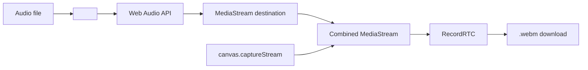

# GeneradorVideoWave — Agent Guide

## Commands
```bash
npm install          # install dependencies
npm run dev          # start dev server on port 3000
npm run build        # build to dist/
npm run preview      # serve dist/ locally
```

No test, lint, or typecheck scripts exist.

## Key architecture

- **Entrypoint**: `src/main.tsx` → `App.tsx` → renders `<AudioVisualizerG />`
- **Only component**: `src/components/AudioVisualizerG.tsx`
- **Styling**: Tailwind CSS v3 (Inter, glass morphism, dark theme, custom scrollbar, animations)
- Single-page app, no routing, no monorepo.

## Sidebar order

| # | Section | Content |
|---|---------|---------|
| 1 | **Audio** (collapsible) | File input + file info |
| 2 | **Onda** (collapsible) | **Forma** (radio, intensidad, grosor), **Color** (color, gradiente, brillo), **Texto** (input + estilo preset + color picker) |
| 3 | **Partículas** (collapsible) | Activar checkbox, color, opacidad slider |
| 4 | **Fondo** (collapsible, expanded) | 3 tabs mutuamente excluyentes: **Color** (presets + picker), **Imagen** (preset select + file upload + remove), **Fractal** (tipo, layer mode, opacidad, reactivo, ripple/spiral/mandala) |
| 5 | — | Waveform preview, Loop preview, Volumen slider, **Previsualizar**, **Detener** |
| 6 | **Exportar** (collapsible) | Resolución (720p/1080p/4K), botón generar |

## State defaults

- `showParticles` = `false`
- `bgMode` = `"color"` (`"color"` | `"image"` | `"fractal"`)
- `fractalEnabled` = `false`
- `particleOpacity` = `0.7`
- `collapsedSections` starts with `"bg"` and `"particles"` collapsed

## Dual-canvas rendering pipeline

Two stacked `<canvas>` inside `relative w-full aspect-square`:

| Canvas | Ref | Z-index | Role |
|--------|-----|---------|------|
| **Fractal/Background** | `fractalCanvasRef` | 0 | Solid color, bg image, or fractal animation |
| **Waveform** | `canvasRef` | 1 | Circular waveform, tip, particles, title. Transparent bg. |

### Drawing order (every frame)

1. **Fractal canvas** — always redrawn:
   - Fractal enabled + replace → fractal only
   - Else → solid `bgColor` or cover-fit `bgImage`
   - Fractal enabled + overlay → fractal on top with `globalAlpha = fractalOpacity`

2. **Waveform canvas background**:
   - Preview first frame: `clearRect()` (transparent)
   - Preview + trail (loop on): `source-atop` black overlay `rgba(0,0,0,0.02)` — only darkens waveform pixels, not transparent areas
   - Recording (all frames): `clearRect()` + `drawImage(fractalCanvas)` → composite background, then full redraw from 0→head

3. **Waveform drawing**: incremental segments, tip, particles, title on transparent canvas. Fractal canvas shows through via CSS layering.

### Tip clearing
- Only clears previous tip when `showParticles` is active
- Uses circular clip (`arc` + `clip`) instead of square `clearRect` to avoid visible artifacts on the trail

## Fractal audio reactive multipliers (adjusted)

| Parameter | Formula | Max multiplier (amp=1) |
|-----------|---------|----------------------|
| Ripple speed | `0.5 + amp * 0.5` | 1.0× |
| Spiral rotation | `0.5 + amp * 0.375` | 0.875× |
| Mandala rotation | `0.5 + amp * 0.375` | 0.875× |

## Video recording (.webm with audio)

Uses `canvas.captureStream(30)` + RecordRTC → `.webm` (VP9). Audio captured via Web Audio API (`createMediaElementSource` + `createMediaStreamDestination`), falls back to `HTMLMediaElement.captureStream()`. Combined `MediaStream` feeds RecordRTC. Tab must be in foreground.


