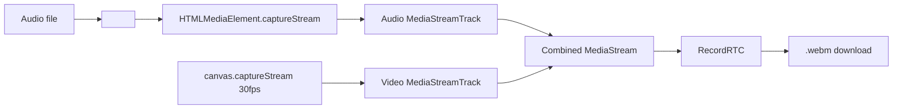

# GeneradorVideoWave — Agent Guide

## Commands
```bash
npm install          # install dependencies
npm run dev          # start dev server on port 3000
npm run build        # build to dist/
npm run preview      # serve dist/ locally
```

No test, lint, or typecheck scripts exist.

## File tree

```
src/
├── main.tsx                  # Entrypoint React (StrictMode → App)
├── App.tsx                   # Layout: header + AudioVisualizerG + footer + YouTube example
├── index.css                 # Tailwind layers, glass/custom scrollbar/range/color/file inputs
├── recordrtc.d.ts            # Type declaration for RecordRTC (any)
├── vite-env.d.ts             # Vite client types
├── components/
│   └── AudioVisualizerG.tsx  # ~2500 lines — single main component
└── hooks/
    └── useAudioAnalyser.ts   # Micrófono hook (getUserMedia → AnalyserNode, NOT integrated)

public/
├── fondo_muestra_1.png
├── fondo_muestra_2.png
├── fondo_muestra_3.png
├── fondo_muestra_4.jpg
└── fondo_muestra_5.png

Infra: Dockerfile, docker-compose.yml, vercel.json, .cert/
```

## Internal components (in AudioVisualizerG.tsx)

| Component | Props | Purpose |
|-----------|-------|---------|
| `CollapsibleSection` | title, icon, collapsed, onToggle, children | Accessible collapsible with `aria-expanded`/`aria-controls`, smooth max-h transition |
| `FileDropZone` | onDrop, children | Drag-and-drop wrapper with visual overlay feedback |

## Utilities & constants

| Symbol | Value/Purpose |
|--------|---------------|
| `TWO_PI` | `2π` |
| `GOLDEN_ANGLE` | `2.39996…` (phyllotaxis spiral) |
| `formatBytes(n)` | B/KB/MB/GB formatting |
| `clamp(n, min, max)` | Number clamping |
| `hexToRgba(hex, alpha)` | Hex → `rgba(r,g,b,a)` |

## Types

```typescript
type Point = { x: number; y: number };
type Particle = { x, y, vx, vy, life, maxLife, size };
type FractalType = "ripple" | "spiral" | "mandala";
type BgMode = "color" | "image" | "fractal";
type WaveGradientMode = "solid" | "gradient" | "rainbow";
```

## Key architecture

- **Entrypoint**: `src/main.tsx` → `App.tsx` → renders `<AudioVisualizerG />`
- **Only component**: `src/components/AudioVisualizerG.tsx`
- **Styling**: Tailwind CSS v3 (Inter, glass morphism, dark theme, custom scrollbar, animations)
- Single-page app, no routing, no monorepo.

## Audio decoding pipeline

1. `onPickFile` → `URL.createObjectURL` + `decodeAudioToMono`
2. `AudioContext.decodeAudioData()` → raw PCM
3. Mix all channels to mono (`Float32Array`)
4. Precompute circular cos/sin arrays mapping `pcmIndex → angle = (idx/total)*2π - π/2`
5. `fftLikePointsPerCircle = 2600` — sample step = `max(1, total/2600)`

Audio is **not** streamed through Web Audio API nodes; raw samples are indexed directly by `currentTime / duration`.

## Sidebar order

| # | Section | Content |
|---|---------|---------|
| 1 | **Audio** (collapsible) | File input + drag-drop + file info |
| 2 | **Onda** (collapsible) | **Forma** (radio, intensidad, grosor), **Color** (color picker, gradiente mode + 2 colors, brillo), **Texto** (input + 10 estilo presets + color picker) |
| 3 | **Partículas** (collapsible) | Activar checkbox, color picker, opacidad slider |
| 4 | **Fondo** (collapsible, starts collapsed) | 3 tabs: **Color** (5 presets + picker), **Imagen** (5 preset select + file upload + remove), **Fractal** (tipo, layer mode, opacidad, reactivo, preview, ripple/spiral/mandala controls) |
| 5 | — | Waveform preview, Loop preview checkbox, Volumen slider, **Previsualizar**, **Detener** |
| 6 | **Exportar** (collapsible) | 720p/1080p/4K, botón generar, advertencia foreground |

## Preset system

| Type | Count | Storage |
|------|-------|---------|
| Quick presets (built-in) | 5 (croma, image, fractal1-3) | Hardcoded in `applyQuickPreset` |
| Saved presets | N | `localStorage: quickPreset_{key}` + `quickPreset_saved` index |
| BG color presets | 5 (dark, purple, cyan, emerald, warm) | Static `bgPresets` array |
| Title presets | 10 (bottom-center, bottom-left, …, compact) | Static `TITLE_PRESETS` array |
| BG image presets | 5 (`fondo_muestra_{1..5}`) | `/public/` files |

Reset defaults: single `resetDefaults()` button restores all 30+ state variables.

## State defaults

- `showParticles` = `false`
- `bgMode` = `"color"`
- `fractalEnabled` = `false`
- `particleOpacity` = `0.7`
- `collapsedSections` starts with `"bg"` and `"particles"`
- Volume = 0.7, Loop = true

## Dual-canvas rendering pipeline

Two stacked `<canvas>` inside `relative w-full aspect-square`:

| Canvas | Ref | Z-index | Role |
|--------|-----|---------|------|
| **Fractal/Background** | `fractalCanvasRef` | 0 | Solid color, cover-fit bg image, or fractal animation |
| **Waveform** | `canvasRef` | 1 | Circular waveform, tip, particles, title. Transparent bg. |

### Drawing order (every frame in `tick()`)

1. **Fractal canvas** — full redraw:
   - If fractal enabled + replace → fractal only
   - Else → solid `bgColor` or cover-fit `bgImage`
   - If fractal enabled + overlay → fractal on top with `globalAlpha = fractalOpacity`

2. **Waveform canvas background**:
   - First frame: `clearRect()` (transparent)
   - Loop/trail active: `source-atop` black overlay `rgba(0,0,0,0.02)` — only darkens waveform pixels
   - Recording: `clearRect()` + `drawImage(fractalCanvas)`, then full redraw from 0→head

3. **Waveform drawing** (`drawAdditionalPath`):
   - Mid-point interpolation between samples for smoother curves
   - Glow pass: `shadowBlur = 25 * glowIntensity` behind main stroke
   - Main stroke: 3 modes — **solid** (waveColor), **gradient** (linear 2-stop), **rainbow** (conic HSL 0-360°)
   - Draws incrementally from `lastDrawnPointIndex → head`

4. **Tip** (`drawTip`): circle at head position, radius `max(2, min(10, lineWidth * 0.9))`

5. **Title** (`drawTitle`): rendered per preset config (font, size, align, position)

6. **Particles** (`updateAndDrawParticles`): update physics, draw fading circles

### Tip clearing
- Only clears previous tip when `showParticles` is active
- Uses circular clip (`arc` + `clip`) instead of square `clearRect` to avoid visible artifacts on the trail

## Particle system

- **Emit**: 2 particles/frame at tip when `showParticles && (preview|record)`
- **Properties**: position, velocity (random angle 0.5-2.5 speed), life (0.5-2s), size (1-4px)
- **Cap**: 300 max (oldest spliced)
- **Rendering**: `globalAlpha = life * particleOpacity`, size shrinks with life

## Fractal types

| Type | Algorithm | Key params |
|------|-----------|------------|
| **Ripple** | Concentric sine-modulated rings: `r = baseR + sin(theta * freq + phase) * amp` | rings (3-20), speed (0.1-3), amplitude (2-60), thickness (0.5-6) |
| **Spiral** | Phyllotaxis: `r = sqrt(i) * scale, angle = i * GA + rotation` | density (50-500), rotation (-3-3), tightness (0.1-1.5), dotSize (0.5-6) |
| **Mandala** | Mirrored arc segments: `arc(0,0,r, -halfArc, +halfArc) × segments × complexity layers` | segments (3-24), rotation (-3-3), complexity (1-6), lineWidth (0.5-5) |

Each has a static preview canvas (80×80) in the UI.

### Fractal audio-reactive multipliers

| Parameter | Formula | Max multiplier (amp=1) |
|-----------|---------|----------------------|
| Ripple speed | `0.5 + amp * 0.5` | 1.0× |
| Ripple amplitude | `0.3 + amp * 0.7` | 1.0× |
| Spiral rotation | `0.5 + amp * 0.375` | 0.875× |
| Spiral scale | `0.6 + amp * 0.8` | 1.4× |
| Spiral dotSize | `0.5 + amp * 0.8` | 1.3× |
| Mandala rotation | `0.5 + amp * 0.375` | 0.875× |

## Canvas sizing

| Mode | Strategy |
|------|----------|
| **Preview** | `syncCanvasSize()` — DPR-aware, responsive to container `getBoundingClientRect()` |
| **Recording** | `setCanvasVideoSize()` — fixed square: 720 / 1080 / 2160 px |
| **Fractal** | `syncFractalCanvasSize()` — mirrors waveform canvas size |

## Video recording (.webm with audio)

Uses `canvas.captureStream(30)` + RecordRTC → `.webm` (VP9). Audio captured via `HTMLMediaElement.captureStream()` (fallback: Web Audio API `createMediaStreamDestination`). Combined `MediaStream` feeds RecordRTC. Tab must be in foreground.

| Resolution | px | Bitrate |
|------------|----|---------|
| 720p | 720 | 8 Mbps |
| 1080p | 1080 | 20 Mbps |
| 4K | 2160 | 50 Mbps |



## Key functions

| Function | Purpose |
|----------|---------|
| `stopAll()` | Stop audio, cancel RAF, stop recorder, reset preview/record state |
| `resetDefaults()` | Reset all 30+ visual parameters to factory defaults |
| `prepareAndPlay(opts)` | Set audio src, volume, loop, play |
| `handlePreview()` | Start animation loop in `"preview"` mode |
| `handleGenerateAndDownloadRealtime()` | Start recording in `"record"` mode |
| `redrawBackgroundCanvas()` | Redraw fractal canvas when params change (idle only) |
| `loadSampleBgImage()` | Load first bg image preset (with procedural fallback) |

## `useAudioAnalyser` hook (not integrated)

Standalone hook at `src/hooks/useAudioAnalyser.ts`:
- Uses `getUserMedia({ audio: true })` → `AnalyserNode` (`fftSize` normalized to power-of-2)
- `requestAnimationFrame` loop reads `getByteFrequencyData`
- Returns `{ isRunning, error, fftSize, data: Uint8Array, start, stop }`
- **Not used** by `AudioVisualizerG` — available for microphone visualization features.


