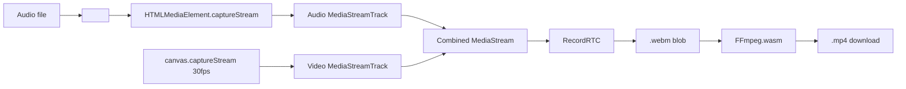

# GeneradorVideoWave — Agent Guide

## Commands

### Docker (primary — dev environment)
```bash
docker compose up -d          # start dev server on port 3000 (background)
docker compose restart        # restart container (pick up code changes)
docker compose down           # stop container
docker compose logs -f        # follow logs
```

### Local (alternative — requires node/npm locally)
```bash
npm install          # install dependencies
npm run dev          # start dev server on port 3000
npm run build        # build to dist/
npm run preview      # serve dist/ locally
```

No test, lint, or typecheck scripts exist.

## File tree

```
src/
├── main.tsx                  # Entrypoint React (StrictMode → App)
├── App.tsx                   # Layout: header + AudioVisualizerG + footer + YouTube example
├── index.css                 # Tailwind layers, glass/custom scrollbar/range/color/file inputs
├── ffmpeg.d.ts               # Type declarations for FFmpeg.wasm (FFmpegInstance, Window.FFmpeg)
├── recordrtc.d.ts            # Type declaration for RecordRTC (any)
├── vite-env.d.ts             # Vite client types
├── components/
│   ├── AudioVisualizerG.tsx  # ~1894 lines — main component (refactored, sections extracted)
│   ├── CollapsibleSection.tsx # Reusable collapsible wrapper (extracted from AudioVisualizerG)
│   ├── ConversionProgress.tsx # Cyberpunk terminal overlay during WebM→MP4 conversion
│   ├── FileDropZone.tsx      # Drag-and-drop wrapper (extracted from AudioVisualizerG)
│   ├── IAAsistentPanel.tsx   # IA Assistant checkbox + mode selector + BPM/beat status + playback controls
│   └── sidebar/
│       ├── AudioSection.tsx
│       ├── PresetsSection.tsx
│       ├── WaveSection.tsx
│       ├── BgSection.tsx
│       ├── FractalSection.tsx
│       ├── InstinctSection.tsx
│       ├── ParticlesSection.tsx
│       ├── TextSection.tsx
│       └── ExportSection.tsx
├── hooks/
│   ├── useAudioAnalyser.ts   # Micrófono hook (getUserMedia → AnalyserNode, NOT integrated)
│   └── useIAAsistent.ts      # IA Assistant hook: BPM detection, beat scheduling, parameter changes
└── utils/
    ├── audio.ts              # ~30 lines — buildPrecomputedGeometry, getCurrentAmplitude (extracted)
    ├── canvas.ts             # ~28 lines — clearCanvasSolid, syncAllCanvasSizes, setCanvasVideoSize (extracted)
    ├── convertWebmToMp4.ts   # FFmpeg.wasm init + WebM→MP4 conversion (ultrafast preset)
    ├── fondo.ts              # ~34 lines — BgMode, bgPresets, drawFondoCanvas
    ├── fractals.ts           # ~330 lines — FractalType, FractalParams, ripple/spiral/mandala draw + preview
    ├── instinct.ts           # ~277 lines — InstinctMode, InstinctParams, 4 instinct modes + drawInstinctPreview
    ├── particles.ts          # ~38 lines — Particle, emitParticles, updateAndDrawParticles
    ├── title.ts              # ~55 lines — TITLE_PRESETS, drawTitle
    └── wave.ts               # ~127 lines — Point, fftLikePointsPerCircle, drawAdditionalPath, drawTip, drawStaticWaveform

public/
├── fondo_muestra_1.png
├── fondo_muestra_2.png
├── fondo_muestra_3.png
├── fondo_muestra_4.jpg
└── fondo_muestra_5.png

Infra: Dockerfile, Dockerfile.dev, docker-compose.yml, vercel.json, .cert/
```

## Utilities & constants

| Symbol | Source | Value/Purpose |
|--------|--------|---------------|
| `TWO_PI` | fractals.ts | `2π` |
| `GOLDEN_ANGLE` | fractals.ts | `2.39996…` (phyllotaxis spiral) |
| `fftLikePointsPerCircle` | wave.ts | `2600` (sample step divisor) |
| `TITLE_PRESETS` | title.ts | 10 title style presets |
| `bgPresets` | fondo.ts | 5 background color presets |
| `formatBytes(n)` | AudioVisualizerG.tsx | B/KB/MB/GB formatting |
| `clamp(n, min, max)` | fractals.ts | Number clamping |
| `hexToRgba(hex, alpha)` | fractals.ts | Hex → `rgba(r,g,b,a)` |

## Types

```typescript
// fractals.ts
type FractalType = "ripple" | "spiral" | "mandala";
interface FractalParams { fractalType, fractalAudioReactive, ripple*, spiral*, mandala*, bgColor }

// instinct.ts
type InstinctMode = "water" | "organic" | "fragments" | "ifs";
interface InstinctParams { instinctMode, instinctSpeed, instinctStrength, instinctFrequency, bgColor, fractalAudioReactive }

// wave.ts
type Point = { x: number; y: number };
type WaveStyle = { radiusRatio, intensity, strokeWidth, waveColor, glowIntensity, waveGradientMode, gradColor1, gradColor2 };
type WaveData = { monoSamples, cosArr, sinArr, totalSamples, sampleStep, pointCount };

// particles.ts
type Particle = { x, y, vx, vy, life, maxLife, size };

// fondo.ts
type BgMode = "color" | "image" | "fractal";

// AudioVisualizerG.tsx
type WaveGradientMode = "solid" | "gradient" | "rainbow";
```

## Key architecture

- **Entrypoint**: `src/main.tsx` → `App.tsx` → renders `<AudioVisualizerG />`
- **Main component**: `src/components/AudioVisualizerG.tsx`
- **Styling**: Tailwind CSS v3 (Inter, glass morphism, dark theme, custom scrollbar, animations)
- Single-page app, no routing, no monorepo.

## Audio decoding pipeline

1. `onPickFile` → `URL.createObjectURL` + `decodeAudioToMono`
2. `AudioContext.decodeAudioData()` → raw PCM
3. Mix all channels to mono (`Float32Array`)
4. Precompute circular cos/sin arrays mapping `pcmIndex → angle = (idx/total)*2π - π/2`
5. `fftLikePointsPerCircle = 2600` — sample step = `max(1, total/2600)`

Audio is **not** streamed through Web Audio API nodes; raw samples are indexed directly by `currentTime / duration`.

## Sidebar order

| # | Section | Content |
|---|---------|---------|
| 0 | — | **IA Assistant** checkbox + mode (agresivo/sensible) + BPM + compás + mini waveform + **Volumen slider + [Previsualizar \| Detener] + Loop** + botón **Colapsar** + botón **↺ Reset** |
| 1 | **Audio** (collapsible, open by default) | File input + drag-drop + file info |
| 2 | **Presets** (collapsible) | Grid 5 presets + [← Resetear valores \| Guardar preset] |
| 3 | **Onda** (collapsible) | **Mostrar onda** checkbox, **Forma** (radio, intensidad, grosor, brillo), **Color** (color picker + gradiente select side by side, conditional Color 1/2) |
| 4 | **Fondo** (collapsible) | 2 tabs: **Color** (5 presets + picker), **Imagen** (5 preset select + file upload + remove) |
| 5 | **Fractal** (collapsible) | Activar checkbox, tipo (ripple/spiral/mandala), reactivo al audio, opacidad, preview (80×80) + controles específicos por tipo |
| 6 | **Instinto Inconsciente** (collapsible) | Activar checkbox, modo (water/organic/fragments/ifs), velocidad, intensidad, frecuencia, preview (80×80) + botones ▲/▼ reordenar capa |
| 7 | **Partículas** (collapsible) | Activar checkbox, color picker, opacidad slider |
| 8 | **Texto** (collapsible) | Input título, selector estilo (10 presets), color picker |
| 9 | **Exportar** (collapsible) | Resolución 720p/1080p/4K, botón **Grabar y descargar** (icono rojo), advertencia foreground |

## Preset system

| Type | Count | Storage |
|------|-------|---------|
| Quick presets (built-in) | 5 (croma, image, fractal1-3) | Hardcoded in `applyQuickPreset` |
| Saved presets | N | `localStorage: quickPreset_{key}` + `quickPreset_saved` index |
| BG color presets | 5 (dark, purple, cyan, emerald, warm) | Static `bgPresets` array |
| Title presets | 10 (bottom-center, bottom-left, …, compact) | Static `TITLE_PRESETS` array |
| BG image presets | 5 (`fondo_muestra_{1..5}`) | `/public/` files |

Reset defaults: single `resetDefaults()` button restores all 30+ state variables.

## State defaults

- `showWave` = `true`
- `showParticles` = `false`
- `bgMode` = `"color"`
- `bgColor` = `"#000000"`
- `fractalEnabled` = `false`
- `fractalType` = `"ripple"`
- `fractalLayerMode` = `"overlay"`
- `fractalOpacity` = `0.8`
- `fractalAudioReactive` = `true`
- `particleColor` = `"#a78bfa"`
- `particleOpacity` = `0.7`
- `collapsedSections` starts with `"presets"`, `"wave"`, `"bg"`, `"fractal"`, `"instinct"`, `"particles"`, `"text"`, `"export"` (todo colapsado excepto Audio)
- Volume = 0.7, Loop = true
- `radiusRatio` = `0.60`, `intensity` = `0.80`, `strokeWidth` = `1.0`, `glowIntensity` = `0.40`
- `waveColor` = `"#ffffff"`, `waveGradientMode` = `"solid"`, `gradColor1` = `"#6366f1"`, `gradColor2` = `"#a855f7"`
- `songTitle` = `""`, `titleColor` = `"#ffffff"`, `titlePreset` = `"bottom-center"`
- `resolution` = `"1080p"`, `loop` = `true`, `isLoopingUI` = `true`

## 5-canvas rendering pipeline

Five stacked `<canvas>` inside `relative w-full aspect-square`. CSS z-index handles compositing in preview mode; `ondaCanvas` composites all layers via `drawImage` during recording for `captureStream(30)`. Layers are **reorderable** (fondo is always z-0).

| Canvas | Ref | z-index | Role | Preview | Recording |
|--------|-----|---------|------|---------|-----------|
| **Fondo** | `fondoCanvasRef` | 0 | Solid color or cover-fit bg image | CSS stacking | Composited into ondaCanvas |
| **Fractal** | `fractalCanvasRef` | 1 | Ripple/spiral/mandala (independent transforms) | CSS stacking | Composited into ondaCanvas |
| **Instinct** | `instinctCanvasRef` | 1 | Instinct modes (captures layers below) | CSS stacking | Composited into ondaCanvas |
| **Onda** | `ondaCanvasRef` | 2 | Circular waveform, tip, particles. Transparent bg. | Transparent (others show through) | Master canvas — composites all layers, draws waveform |
| **Letras** | `letrasCanvasRef` | 3 | Title text (independent animation) | CSS stacking on top | Skipped (title drawn directly on ondaCanvas) |

### Drawing order (every frame in `tick()`)

1. **Fondo canvas** — `drawFondoCanvas(fctx, fc, bgColor, bgImage)` (solid color or cover-fit bg image)

2. **Fractal canvas** — `clearRect()` + `drawFractalBackground()` with `globalAlpha = fractalOpacity` (if enabled)

3. **Instinct canvas** — pre-renders by accumulating layers below it in `layerOrder` into `tempCanvas`, then applies `drawInstinctFractal()` distortion

4. **Onda canvas background**:
   - **Preview**: `clearRect()` (transparent — layers show through via CSS)
   - **Recording**: `clearRect()` + `drawImage` of each layer in `layerOrder` (fondo→fractal→instinct→onda→letras)

5. **Waveform drawing** (`drawAdditionalPath`):
   - Mid-point interpolation between samples for smoother curves
   - Glow pass: `shadowBlur = 25 * glowIntensity` behind main stroke
   - Main stroke: 3 modes — **solid** (waveColor), **gradient** (linear 2-stop), **rainbow** (conic HSL 0-360°)
   - Draws incrementally from `lastDrawnPointIndex → head`

6. **Tip** (`drawTip`): circle at head position, radius `max(2, min(10, lineWidth * 0.9))`

7. **Particles** (`updateAndDrawParticles`): update physics, draw fading circles (on onda canvas)

8. **Title** (`drawTitle`):
   - **Preview**: drawn on `letrasCanvas` (z-index 3, independent layer)
   - **Recording**: drawn directly on `ondaCanvas` so `captureStream()` includes it

### Tip clearing
- Only clears previous tip when `showParticles` is active
- Uses circular clip (`arc` + `clip`) instead of square `clearRect` to avoid visible artifacts on the trail

## Particle system

- **Emit**: 2 particles/frame at tip when `showParticles && (preview|record)`
- **Properties**: position, velocity (random angle 0.5-2.5 speed), life (0.5-2s), size (1-4px)
- **Cap**: 300 max (oldest spliced)
- **Rendering**: `globalAlpha = life * particleOpacity`, size shrinks with life

## Fractal types

| Type | Algorithm | Key params |
|------|-----------|------------|
| **Ripple** | Concentric sine-modulated rings: `r = baseR + sin(theta * freq + phase) * amp` | rings (3-20), speed (0.1-3), amplitude (2-60), thickness (0.5-18) |
| **Spiral** | Phyllotaxis: `r = sqrt(i) * scale, angle = i * GA + rotation` | density (50-500), rotation (0-1), tightness (0.1-1.5), dotSize (3-12) |
| **Mandala** | Mirrored arc segments: `arc(0,0,r, -halfArc, +halfArc) × segments × complexity layers` | segments (3-24), rotation (0-1), complexity (1-6), lineWidth (0.5-20) |

Each has a static preview canvas (80×80) in the UI.

### Fractal audio-reactive multipliers

| Parameter | Formula | Max multiplier (amp=1) |
|-----------|---------|----------------------|
| Ripple speed | `0.5 + amp * 0.5` | 1.0× |
| Ripple amplitude | `0.3 + amp * 0.7` | 1.0× |
| Spiral rotation | `0.7 + amp * 0.15` | 0.85× |
| Spiral scale | `0.6 + amp * 0.8` | 1.4× |
| Spiral dotSize | `0.5 + amp * 0.8` | 1.3× |
| Mandala rotation | `0.5 + amp * 0.375` | 0.875× |

## IA Assistant (feat_ia_controller)

Sistema de control automático de parámetros visuales sincronizado con el ritmo de la canción.

### Componentes

| Archivo | Rol |
|---------|------|
| `src/hooks/useIAAsistent.ts` | Hook: BPM detection, beat scheduling, parameter changes |
| `src/components/IAAsistentPanel.tsx` | UI: checkbox + modo + BPM/beat display + mini waveform + controles de playback (volumen, previsualizar/detener, loop, colapsar, reset) |

### Tipos

```typescript
type IAIAssistantMode = "aggressive" | "sensitive";
```

### BPM Detection

- **Algoritmo**: Autocorrelación sobre envolvente de energía RMS (ventana 2048, hop 512)
- Diferenciación para detección de onsets → autocorrelación → mejor lag → BPM
- Rango detectable: 70–200 BPM
- Fallback: 120 BPM si la señal es muy corta
- Se ejecuta en el `useEffect` al activarse o al cargar nuevo audio

### Resolución dinámica según amplitud

El intervalo de beat se ajusta en tiempo real según `getCurrentAmplitude()`:

| Amplitud | Resolución | Factor |
|----------|-----------|--------|
| > 0.5 | **Corchea** | interval/2 |
| 0.2–0.5 | **Negra** | interval |
| < 0.2 | **Blanca** | interval × 2 |

### Scheduled changes (`applyBeatChanges`)

Disparados en el `tick()` cada vez que se cruza un beat. No modifican forma de la onda (intensity, strokeWidth, radiusRatio, glowIntensity se mantienen intactos).

| Cada X beats | Cambios | Prob (agresivo) | Prob (sensible) |
|-------------|---------|:---:|:---:|
| 4 | waveColor, waveGradientMode, gradColor1/2, showParticles, particleColor | 85% | 45% |
| 8 | fractalEnabled, fractalType, rippleSpeed, rippleAmplitude, rippleThickness, rippleColor1, rippleColor2, instinctEnabled, instinctMode | 100% | 70% |
| 16 | spiralRotationSpeed, spiralTightness, spiralDotSize, mandalaRotationSpeed, mandalaLineWidth, fractalOpacity, spiralColor1, mandalaColor1, instinctSpeed, instinctStrength, instinctFrequency | 100% | 90% |

### Integración en AudioVisualizerG.tsx

- **Hook** llamado después de `paramsRef` useEffect (línea ~466)
- **Ref** `iaStateRef` para acceso desde el closure del `tick()` sin re-renders
- **Tick**: `ia.update(currentTime, getCurrentAmplitude())` después de `paramsRef.current` (línea ~1390)
- **Panel**: `<IAAsistentPanel>` renderizado al inicio del sidebar (antes de Reset)
- **sampleRate** guardado en `sampleRateRef` durante `decodeAudioToMono`
- **Fondo negro estático**: al activarse la IA, un `useEffect` pone `bgMode="fractal"`, `bgColor="#000000"`, `fractalEnabled=true`, `fractalLayerMode="overlay"`, además de fijar radio=0.50, intensidad=0.70, grosor=1.0, opacidad partículas=0.10 y bgImage=null. El fondo nunca cambia mientras la IA está activa.
- **Visibilidad de controles fractales**: los controles del fractal se muestran también cuando `fractalEnabled=true` aunque `bgMode !== "fractal"` (para que el usuario vea los cambios de la IA).
- **Playback controls**: Volume slider, Previsualizar/Detener buttons y Loop checkbox renderizados dentro de IAAsistentPanel (debajo del mini waveform), eliminados de la sección Exportar.
- **Botón Colapsar y ↺ Reset**: renderizados dentro del panel IA (prop `onCollapseAll` y `onResetDefaults`).

## Canvas sizing

| Mode | Strategy |
|------|----------|
| **Preview** | `syncAllCanvasSizes()` — DPR-aware, resizes all 5 canvases based on container `getBoundingClientRect()` |
| **Recording** | `setCanvasVideoSize()` — fixed square: 720 / 1080 / 2160 px, all 5 canvases

## Video recording (.webm → MP4 via FFmpeg.wasm)

Uses `canvas.captureStream(30)` + RecordRTC → `.webm` (VP9). Audio captured via `HTMLMediaElement.captureStream()` (fallback: Web Audio API `createMediaStreamDestination`). Combined `MediaStream` feeds RecordRTC. Tab must be in foreground.

After recording, the WebM blob is converted to MP4 (H.264 + AAC) using FFmpeg.wasm with `-preset ultrafast` (~3-6s for a 4-min song). Output filename matches the input file (e.g. `cancion.mp3` → `cancion.mp4`).

| Resolution | px | Bitrate |
|------------|----|---------|
| 720p | 720 | 8 Mbps |
| 1080p | 1080 | 20 Mbps |
| 4K | 2160 | 50 Mbps |



FFmpeg.wasm is loaded on mount from CDN (`@ffmpeg/ffmpeg@0.11.6` + `@ffmpeg/core@0.11.0`). If loading fails, falls back to direct WebM download.

## Key functions

| Function | Purpose |
|----------|---------|
| `stopAll()` | Stop audio, cancel RAF, stop recorder, reset preview/record state |
| `resetDefaults()` | Reset all 30+ visual parameters to factory defaults |
| `prepareAndPlay(opts)` | Set audio src, volume, loop, play |
| `handlePreview()` | Start animation loop in `"preview"` mode |
| `handleGenerateAndDownloadRealtime()` | Start recording in `"record"` mode |
| `downloadBlob(blob, extension, customName?)` | Download blob with filename derived from input file or fallback `audio-visualizer-{Date}` |
| `redrawFondoCanvas()` | Redraw background canvas (solid color or image) when params change (idle only) |
| `redrawFractalCanvas()` | Redraw fractal canvas when params change (idle only) |
| `drawFondoCanvas(ctx, canvas, bgColor, bgImage)` | fondo.ts — solid color or cover-fit bg image |
| `drawInstinctFractal(ctx, canvas, params, amp, bgCanvas)` | instinct.ts — dispatcher to 4 instinct modes |
| `drawInstinctPreview(ctx, w, h, params)` | instinct.ts — 80×80 instinct preview |
| `loadSampleBgImage()` | Load first bg image preset (with procedural fallback) |

## `useAudioAnalyser` hook (not integrated)

Standalone hook at `src/hooks/useAudioAnalyser.ts`:
- Uses `getUserMedia({ audio: true })` → `AnalyserNode` (`fftSize` normalized to power-of-2)
- `requestAnimationFrame` loop reads `getByteFrequencyData`
- Returns `{ isRunning, error, fftSize, data: Uint8Array, start, stop }`
- **Not used** by `AudioVisualizerG` — available for microphone visualization features.

## Versioning

- La versión se define como string en `src/App.tsx` al final del layout
- Se actualiza manualmente antes de cada push a la rama `main`
- Formato semver: `MAJOR.MINOR.PATCH`
  - **MAJOR**: cambios incompatibles o rediseño visual grande
  - **MINOR**: nuevas funcionalidades, secciones o integraciones
  - **PATCH**: bugfixes, ajustes UI, refactors menores

## Refactoring history

- **v1.1.1** — Extracción de componentes visuales: CollapsibleSection, FileDropZone, 9 secciones del sidebar, y utilidades canvas/audio de AudioVisualizerG.tsx (~2562 → ~1894 líneas).

